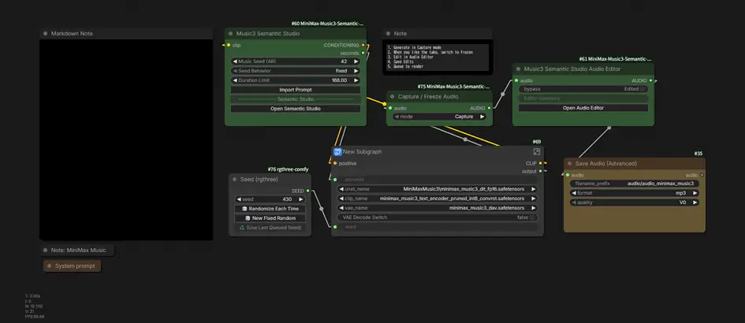
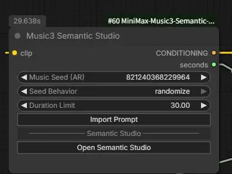

# MiniMax Music3 Semantic Studio

**Music3 Semantic Studio** is an external ComfyUI custom-node package for MiniMax Music 3 generation design and non-destructive post-generation audio editing.

Current status:

- **Semantic Studio** — Timeline / Lyrics / Generation UI implemented
- **English / Japanese UI** — ComfyUI locale-aware labels implemented; other locales fall back to English
- **Capture / Freeze Audio** — generated AUDIO can be captured to CPU RAM and reused for editor-only Queue runs without re-running Music3/KSampler
- **Audio Editor** — unified waveform editor, schema-2 automation, Browser Draft Preview, Edit / Mixer / Effects workspace, selection tools and non-destructive fades implemented
- **Built-in DSP** — Gain, Compressor, Limiter, EQ / filters, Stereo Width, Reverb and Stereo Delay implemented
- **VST3** — optional Windows VST3 host, native plug-in UI and state capture available on demand

Neither Semantic Studio nor the Audio Editor patches ComfyUI core, MiniMax Music3 model code, KSampler, or VAE code.

## Installation

```bash
cd ComfyUI/custom_nodes
git clone https://github.com/ukr8b3g-cmyk/MiniMax-Music3-Semantic-Studio.git
```

Restart ComfyUI after install/update. The core node package has no additional mandatory Python runtime dependency. The Windows VST3 host is optional and is installed only when a user explicitly requests it from the VST3 workspace.

## V1 template workflow

The V1 template is [`workflows/MiniMax_Music3_Semantic_Studio_V1.json`](workflows/MiniMax_Music3_Semantic_Studio_V1.json).

It uses one connected generation-to-editing workflow:

```text
Music3 Semantic Studio
        ↓
MiniMax Music3 generation / decode
        ↓
Capture / Freeze Audio
        ↓
Music3 Semantic Studio Audio Editor
        ↓
Save Audio (Advanced)
```

The template keeps the MiniMax Music3 generation/decode group as a ComfyUI subgraph, including the VAE Decode switch from the upstream template. The KSampler seed is exposed through an **rgthree Seed** node because the seed control inside the subgraph is otherwise inconvenient to use. Install `rgthree-comfy` if you use the template as-is.

The recommended V1 operation is:

1. Leave **Capture / Freeze Audio** in **Capture** mode and Queue to generate a take.
2. When the generated take is the one you want to edit, switch the node to **Frozen**.
3. Open the Audio Editor, make edits, and click **Save Edits**.
4. Queue again to render the edited AUDIO. In Frozen mode the stored AUDIO snapshot is reused, so the Music3/KSampler generation branch is not requested.
5. To generate a different take, switch back to **Capture**, Queue again, then return to **Frozen** for editing.

The frozen snapshot is stored in CPU RAM for the current ComfyUI session. Restarting ComfyUI clears it; after a restart, switch to Capture and generate/capture again.

## Quick start — visual workflow

The normal workflow is:

```text
Import Prompt / design in Semantic Studio
                 ↓
              Queue
                 ↓
          generated AUDIO
                 ↓
       Capture / Freeze Audio
                 ↓
       switch Capture -> Frozen
                 ↓
          Open Audio Editor
                 ↓
     Edit / Mixer / Effects / VST3
                 ↓
             Save Edits
                 ↓
              Queue
                 ↓
       authoritative edited AUDIO
```

## Screenshots / UI Gallery

All README screenshots are collected here so they can be maintained and replaced in one place.

### Workflow overview



### Semantic Studio


### Audio Editor


### Semantic Studio node controls



### Import Prompt and Lyrics workspaces


### Timeline, Instruments and Generation


### Audio Editor controls


### VST3 native plug-in UI


### 1. Start from the Semantic Studio node

The compact graph node keeps the main generation controls close to the workflow. **Music Seed (AR)** controls the MiniMax Music3 autoregressive stage, **Seed Behavior** selects the normal ComfyUI seed behavior such as Randomize or Fixed, and **Duration Limit** sets the AR generation ceiling. **Import Prompt** opens the structured prompt importer; **Open Semantic Studio** opens the full authoring interface.

The Music3 AR seed and the later KSampler seed control different stages of generation.

### 2. Import a prompt, inspect it, then edit Lyrics

**Import Prompt** is intended for Caption / Lyrics text prepared in another LLM or editor. Paste the material, click **Analyze**, inspect the detected global settings, vocals and sections in **Import Preview**, then click **Apply Import**. The usual mode is **Replace section structure**; **Merge detected fields** is available for incremental updates.

The **Lyrics** workspace is split into three practical views:

- **Caption** — the compiled semantic description sent through the Music3 text-conditioning path
- **Full Lyrics** — the complete tagged lyrics document
- **Section Lyrics** — lyrics grouped by Intro / Verse / Chorus / Outro and other timeline sections

Full Lyrics can be edited directly and then applied back to matching sections. Section Lyrics can also be edited independently when only one part of the song needs adjustment.

### 3. Shape the song structure, Energy, Instruments and AR generation

The **Timeline** is a semantic song plan rather than a stem editor. Click a section to edit it in the Section Inspector. Duration, section type, vocal direction and other section fields can be adjusted there. **Energy** can be edited numerically and also manipulated from the timeline graph; it describes the intended musical intensity for generation, not the amplitude of already-rendered audio.

The **Instruments** lanes are per-section semantic guidance. Turning an instrument lane off for a section means that instrument is no longer requested for that section; it does **not** delete an audio stem. These lanes describe what MiniMax Music3 should aim to generate.

The **Generation** tab edits the same underlying ComfyUI node widgets used at execution time:

- **Music Seed (AR)** — autoregressive music/token randomness
- **Seed Behavior (AR)** — Fixed / Randomize / Increment / Decrement behavior
- **Music CFG (AR)** — autoregressive token guidance
- **Music Top-K** — AR token candidate restriction
- **Duration Limit** — maximum AR generation duration
- **Auto Sync with Timeline** — keeps the duration ceiling aligned with the semantic timeline total

These controls are separate from KSampler Seed and KSampler CFG later in the graph.

### 4. Capture the take, then edit the generated audio

In the V1 template, decoded `AUDIO` goes through **Capture / Freeze Audio** before entering **Music3 Semantic Studio Audio Editor**. Queue once in **Capture** mode. When the take is the one you want to keep, switch to **Frozen**, then click **Open Audio Editor**.

The right-side workspaces have separate roles:

- **Edit** — source range, timeline position, clip gain/pan, fades, reverse and clip mute
- **Mixer** — track input gain/pan plus master output gain, channel mode and normalization
- **Effects** — built-in non-destructive DSP rack
- **VST3** — optional third-party Windows VST3 effects

The built-in Effects rack includes **Gain / Amplify, Compressor, Limiter, EQ (3-Band), High-Pass Filter, Low-Pass Filter, Stereo Width, Reverb and Stereo Delay**. Effects can be enabled/bypassed, reset, removed and reordered.

**Envelope** means gain automation over time. Use the Envelope tool to add and move points on the waveform so the track becomes louder or quieter across chosen parts of the timeline. This is post-generation audio level automation and is different from the Semantic Studio **Energy** guidance used before generation.

For a conventional fade workflow, drag a range on the waveform, right-click the selection, then choose **Fade In** or **Fade Out**. Contiguous fragments from the same source AUDIO are treated as one logical selection where safe, so fades can reach the true beginning/end even after earlier non-destructive splits.

### What happens after editing?

Audio Editor changes are non-destructive. In the V1 template, the **Frozen** AUDIO snapshot becomes the stable source used for edit rendering during the current session.

1. Browser **Draft · Current Edits** gives immediate preview feedback for supported built-in edits/effects.
2. **Save Edits** stores the current edit state back into the Audio Editor node.
3. **Queue** the workflow again while Capture / Freeze Audio remains **Frozen**.
4. The Python/PyTorch backend applies the saved edit state to the frozen AUDIO and outputs the authoritative edited `AUDIO`.
5. A downstream Preview/Save Audio node receives that edited output.

So **Save Edits does not permanently rewrite the source audio**. The final result is created when the Audio Editor node is queued again.

### 5. Optional VST3 effects and native plug-in UI

VST3 support is for users who already work with third-party audio plug-ins. The example above shows **MuseFX Chorus** and **MuseFX Compress**; MuseFX is only an example and is **not bundled** with this repository. VST3 plug-ins themselves must be installed by the user in the normal Windows VST3 locations.

The VST3 host is also optional. On Windows, when the Audio Editor detects that the host is missing, the VST3 workspace shows **Install VST3 Host**. Clicking that button explicitly installs the fixed Pedalboard host package into the same Python environment currently running ComfyUI. Users who never open/use VST3 do not need to install it.

After the host reports **Ready**:

1. Click **+ Add VST3** and choose an installed effect.
2. Click **Open UI** to launch the plug-in's original native Windows interface.
3. Change the plug-in settings.
4. Close the native UI; the editor captures the plug-in state.
5. Click **Save Edits** and Queue the workflow to apply the VST3 processing to authoritative AUDIO.

Browser Draft does not replace the authoritative VST3 render. Queue rendering remains the source of truth for third-party VST3 processing.

## Semantic Studio — generation design

- Node ID: `MiniMaxMusic3SemanticStudio`
- Display name: `Music3 Semantic Studio`
- Category: `model/conditioning/minimax music`
- Outputs: `CONDITIONING`, `seconds`

```text
Load CLIP
   |
   v
Music3 Semantic Studio ---------------------> KSampler positive
   |
   +---- seconds ----> Empty MiniMax Music3 Latent Audio ----> KSampler latent_image

Load Diffusion Model -----------------------------------------> KSampler model
Conditioning Zero Out ----------------------------------------> KSampler negative
```

Click **Open Semantic Studio** to open the authoring UI. Semantic Studio and the Audio Editor open maximized by default and can be restored to the remembered normal size.

Semantic Studio is semantic: BPM, key, exact section timing, energy, vocal treatment and instrumentation are generation targets rather than strict symbolic guarantees.

### Timeline / Lyrics / Generation

The main views are explicit horizontal tabs:

- **Timeline** — song design, structure, energy, vocal style and instrument guidance
- **Lyrics** — Caption, complete tagged Lyrics and per-section Lyrics editing
- **Generation** — MiniMax Music3 autoregressive generation controls

The Timeline header exposes Genre, BPM, Key, Scale / Mode, **Effective Key** (for example `D minor`), Meter and Vocal / Instrumental mode. Key and Scale remain stored separately; Effective Key is display-only.

`Main Vocal` contains the song-wide lead/voice type, timbre, delivery, harmony and vocal-effects wording. `More Settings` contains title, subgenres/influences, mood/direction and production profile. Preset-backed expressive fields remain editable and searchable; imported/custom wording is not locked to the local catalog.

The complete Song Timeline is an accordion that defaults open. Timeline order remains:

1. Structure
2. Energy
3. Lyrics summary
4. Vocal Style
5. Instruments

Structure sections can be added after the current selection, resized and reordered by drag/drop or Inspector arrows. Instrument lanes are semantic `section.instruments[]` guidance rather than stems or audio analysis. Each section owns its own instrument membership.

Undo / Redo is available for structured project editing:

```text
Ctrl/Cmd+Z             Undo
Ctrl/Cmd+Shift+Z       Redo
Ctrl/Cmd+Y             Redo
```

### Lyrics workspace

The Lyrics workspace contains:

1. **Caption** — authoritative compiler Caption; `Edit` creates a temporary Draft that must pass Analyze -> Import Preview -> Apply.
2. **Full Lyrics** — editable tagged Lyrics; `Apply to Sections` updates matching section Lyrics while preserving semantic fields.
3. **Section Lyrics** — compact per-section accordion.

### Generation controls

Generation edits the **same existing ComfyUI node widgets**; it does not duplicate these values into `project_json`:

- `seed` -> **Music Seed (AR)**
- `max_duration` -> **Duration Limit**
- `cfg_scale` -> **Music CFG (AR)**
- `top_k` -> **Music Top-K**
- linked ComfyUI value-control widget -> **Seed Behavior (AR)**

These are MiniMax Music3 autoregressive-stage controls and are separate from KSampler controls later in the graph:

```text
Music Seed (AR)  -> autoregressive music/token randomness
KSampler Seed    -> diffusion latent noise

Music CFG (AR)   -> autoregressive token guidance
KSampler CFG     -> diffusion guidance
```

Neither pair overrides the other; the stages are separate and both are used.

Generation shows **Timeline Total** beside **Duration Limit**. `Auto Sync with Timeline` defaults on and keeps the AR duration ceiling synchronized with the semantic section total. It can be disabled for an independent manual ceiling. MiniMax Music3 may end the song earlier than the ceiling.

See [`docs/PHASE_A_SEMANTIC_UI.md`](docs/PHASE_A_SEMANTIC_UI.md).

## Prompt Import

External LLM output can be pasted into **Import Prompt** and processed locally:

```text
Import Prompt
   -> Analyze
   -> Import Preview
   -> Replace / Merge
   -> Semantic Studio fields
```

The normal external-import default is **Replace section structure**. **Merge detected fields** remains available for incremental edits. Prompt Import is deterministic and does not require an LLM connection at runtime.

See [`docs/PROMPT_IMPORT.md`](docs/PROMPT_IMPORT.md).

## Audio Editor — unified non-destructive editing

- Node ID: `MiniMaxMusic3SemanticStudioAudioEditor`
- Display name: `Music3 Semantic Studio Audio Editor`
- Category: `audio/minimax music`
- Input: `audio: AUDIO`
- Output: `AUDIO`

The public V1.0 Audio Editor uses one connected AUDIO input. The supported V1 template workflow places it after Capture / Freeze Audio rather than shipping a separate editor-only workflow.

```text
KSampler
   |
   v
VAE Decode Audio
   |
   v
Capture / Freeze Audio
   |
   v
Music3 Semantic Studio Audio Editor
   |
   v
Preview Audio / Save Audio (Advanced)
```

### First use

For actual editing in the V1 template:

1. Queue once with Capture / Freeze Audio set to **Capture**.
2. Switch Capture / Freeze Audio to **Frozen** after choosing the generated take.
3. Click **Open Audio Editor**.
4. Edit on **Draft · Current Edits**.
5. Click **Save Edits**.
6. Queue again to produce authoritative edited AUDIO without requesting the generation branch.

The Browser Draft Preview is immediate authoring feedback. The Python/PyTorch renderer remains the final source of truth.

### Unified waveform surface

One waveform is the primary editing surface:

- drag to select a range
- click to seek
- Cut / Copy / Paste / Split / Delete / Silence operate on the waveform selection/playhead
- right-click a selected range for **Fade In / Fade Out**
- selection Loop audition repeats the selected range without changing `edit_json`
- thin clip boundaries expose non-destructive clip/source assignments
- track height can be resized vertically and reset; stereo L/R resize together
- Position and Selection time readouts support precise editing
- semantic Tempo / Meter / Key reference and optional Snap are available when one upstream Semantic Studio is resolvable

The right workspace is deliberately compact:

```text
Edit | Mixer | Effects | VST3
```

`Edit` follows the current Clip/Envelope editing context; `Mixer` combines Track and Master controls; `Effects` provides built-in DSP; `VST3` provides optional third-party plug-in hosting on Windows.

Tool modes:

```text
F1  Select
F2  Envelope
```

The visual roles remain distinct: thin cyan playhead, violet selected clip, blue/cyan selection and orange/amber gain envelope. When selection Loop is active, the loop range receives its own green highlight.

### Draft Preview

`Draft · Current Edits` renders the current `edit_json` locally and reflects non-VST3 edits without a Queue round trip, including clip edits, Track Mute/Solo/Gain/Pan, Track Gain Envelope, supported built-in effects, Master processing and channel/normalization settings.

`Rendered A · Last Queue` remains available for A/B comparison. Draft Preview is not authoritative; **Save Edits -> Queue** runs the Python renderer against the frozen source AUDIO tensor.

### Editing commands

- Cut / Copy / Paste at playhead
- Split / Duplicate / Reverse
- Delete / Ripple
- Silence / Leave Gap
- Cut & Leave Gap
- selection Fade In / Fade Out
- clip Mute and track Mute
- equal-power Crossfade Next helper
- selection Loop audition
- Undo / Redo
- stereo L/R split, overlay and mono-mix display
- Preview Peak meter

Keyboard shortcuts:

```text
F1               Select tool
F2               Envelope tool
Ctrl/Cmd+X       Cut
Ctrl/Cmd+C       Copy
Ctrl/Cmd+V       Paste at playhead
Ctrl/Cmd+I       Split
Ctrl/Cmd+D       Duplicate
Delete/Backspace Delete / Ripple
Ctrl/Cmd+L       Silence / Leave Gap
Ctrl/Cmd+Alt+X   Cut & Leave Gap
M                Mute / unmute track
Shift+M          Mute / unmute selected clip
Ctrl/Cmd+Z       Undo
Ctrl/Cmd+Shift+Z Redo
Ctrl/Cmd+Y       Redo
Ctrl/Cmd+S       Save Edits
Ctrl/Cmd+0       Fit
Space            Play / Pause
Shift+Space      Toggle selected-range Loop
Home             Go to start
End              Go to end
```

### Schema 2

`edit_json.edit_schema_version` is **2**. Existing schema-1 projects migrate automatically and retain clip ranges, gain, pan, mute, reverse, fades and legacy clip-envelope data.

Schema 2 adds neutral-by-default track state:

```json
{
  "muted": false,
  "solo": false,
  "gain_db": 0.0,
  "pan": 0.0,
  "gain_envelope": [],
  "effects": [],
  "clips": []
}
```

The backend render order is clip processing -> track automation/controls -> track effects -> track mix -> master effects -> master processing. Source AUDIO remains immutable.

See [`docs/PHASE_B_AUDIO_EDITOR.md`](docs/PHASE_B_AUDIO_EDITOR.md) and [`docs/V2_SPEC.md`](docs/V2_SPEC.md).

## Built-in Effects / DSP

The compact **Effects** workspace uses the existing schema-2 track/master `effects[]` arrays. Effects can be collapsed so only one detailed parameter editor needs to occupy vertical space at a time.

The Effects Rack supports:

- `+ Add Effect` grouped by Level / Dynamics / EQ & Filter / Stereo / Space
- numeric input plus slider for continuous parameters
- ON/OFF state
- reset and delete
- move up/down and drag-handle reordering
- English/Japanese UI labels
- Track and Master processing
- preservation of unknown effect objects

The following effects execute in both Browser Draft and authoritative Python/PyTorch rendering:

- **Gain / Amplify**
- **Compressor**
- **Limiter**
- **EQ (3-Band)**
- **High-Pass Filter**
- **Low-Pass Filter**
- **Stereo Width**
- **Reverb** — Room Size, Pre-delay, Reverberance, Damping, Low/High Tone, Wet/Dry, Wet Only
- **Stereo Delay** — Delay Time, Feedback, Wet/Dry, optional Ping-Pong

Limiter includes `Input Gain` plus an **Auto Level / オートレベル** convenience action. Auto Level measures the current preview peak while the Limiter is off and sets Input Gain toward the selected ceiling; manual adjustment remains available.

Reverb and Stereo Delay report bounded effect tails so spatial decay/repeats are not cut at the timeline boundary.

## Optional Windows VST3 host

VST3 plug-ins are not bundled. Install the desired Windows 64-bit VST3 effects separately using the plug-in vendor's normal installer.

Pedalboard, the VST3 host used by this extension, is **not installed during the normal custom-node installation**. When it is missing, the Windows VST3 workspace offers an explicit **Install VST3 Host** button. The installer:

- uses the same Python interpreter currently running ComfyUI
- installs only the fixed `pedalboard>=0.9.24,<1` package range
- does not accept an arbitrary package name or shell command from the browser
- runs only after an explicit user click

`requirements-vst3.txt` remains as a manual recovery fallback.

See [`docs/VST3_PHASE2B.md`](docs/VST3_PHASE2B.md) and [`docs/VST3_NATIVE_WINDOW.md`](docs/VST3_NATIVE_WINDOW.md).

## English / Japanese UI

The extension follows ComfyUI's locale setting for its user-interface chrome:

- Japanese (`ja...`) -> Japanese node / Studio / Audio Editor labels
- English and all other locales -> English fallback

Node-definition translation files are under `locales/en` and `locales/ja`. Custom Studio/Audio Editor windows read the current ComfyUI locale as well.

**Prompt values, preset values, `project_json` and text sent to MiniMax are not translated.** Localization changes UI presentation only.

## Development checks

```bash
python -m pytest
python -m compileall -q .
node --check web/semantic_studio.js
node --check web/semantic_timeline.js
node --check web/semantic_controls.js
node --check web/prompt_import.js
node --check web/ui_i18n.js
node --check web/studio_shell.js
node --check web/audio_editor.js
node --check web/audio_editor_core.js
node --check web/audio_edit_commands.js
node --check web/audio_draft_core.js
node --check web/audio_draft_preview.js
node --check web/audio_waveform.js
node --check web/audio_panels.js
node --check web/audio_effects_core.js
node --check web/audio_effects_dsp.js
node --check web/audio_effects.js
node --check web/audio_playback_loop.js
node --check web/zz_audio_effects_foundation.js
node --check web/zz_audio_dsp_ui.js
node --check web/zz_audio_selection_fades.js
node --check web/zz_audio_numeric_rounding.js
node --check web/zz_vst3_host_installer.js
npm run test:semantic
npm run test:audio
```

See [`docs/ARCHITECTURE.md`](docs/ARCHITECTURE.md).
